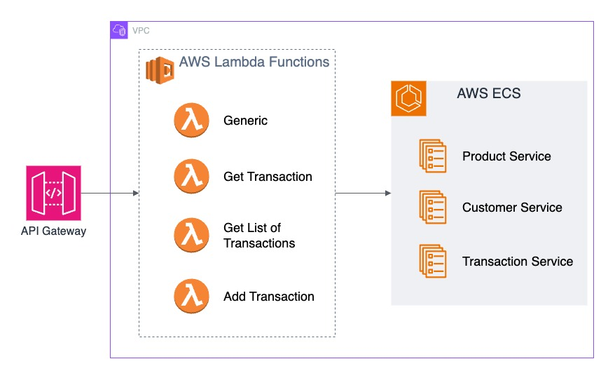

# API Composition with AWS Lambda Functions

This repository contains AWS Lambda functions for API Composition, integrating with internal service endpoints of three microservices. It also includes a shared Lambda layer required by all functions.

## Architecture

Lambda functions act as API Composition functions in this project. API Gateway invokes these functions which in turn request the data from the microservices running in the same VPC as services in AWS Elastic Container Service.

## Fucntions

- [**imsGenericLambda:**](/Functions/imsGenericLambda.py) Middle layer between API Gateway and Product and Customer microservices
- [**imsTransactionGetOne:**](/Functions/imsTransactionGetOne.py) This function fetches the required information from all three microservices
- [**imsGetTransactions:**](/Functions/imsGetTransactions.py) Fetches list of transactions and fills the list with names of products and customers before returning the data
- [**imsTransactionAdd:**](/Functions/imsTransactionAdd.py) Updates the inventory of products in the product microservice and adds the transaction in Transaction microservice, rollbacks if any product could not be updated due to any reason.

## Layers

Request layer is used in each function, to make the requests library available.
